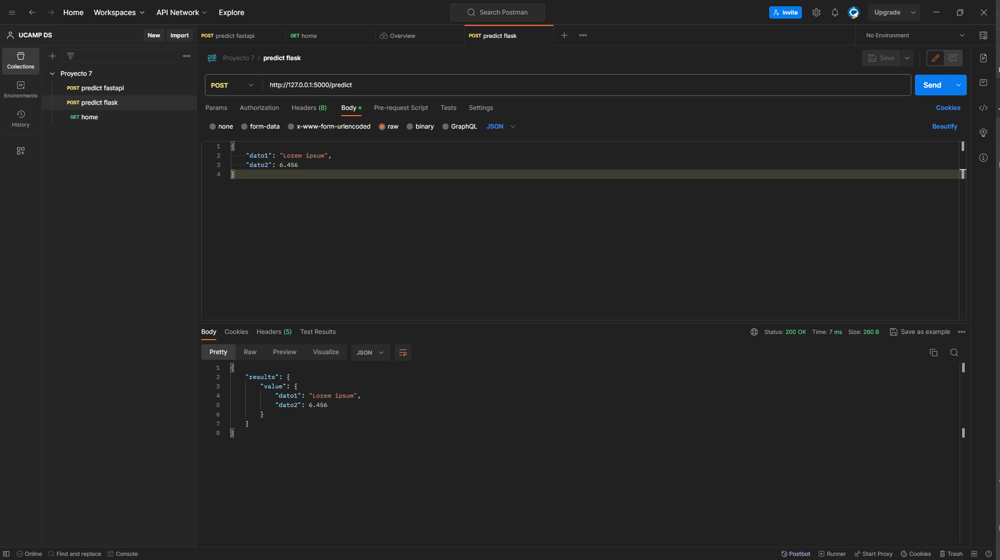

# UCAMP Service Flask

Plantilla para exponer a través de un servicio web,
la función `predict` de un modelo de ML/DL.

## Pasos

1. Crear un entorno virtual (virtualenv)
2. Instalar las dependencias `pip install -r requirements.txt`
3. Colocar el código en el archivo `model.py`
4. Ejecutar el servicio `python main.py`

## ¿Cómo probar el servicio?

Una vez realizados los pasos anteriores puede probar
el servicio a traves del navegador o cualquier cliente
rest como postman.

- Postman: debes realizar un post a http://127.0.0.1:5000/predict 
           enviando como body un JSON con la información que requiere 
           el modelo.

    
